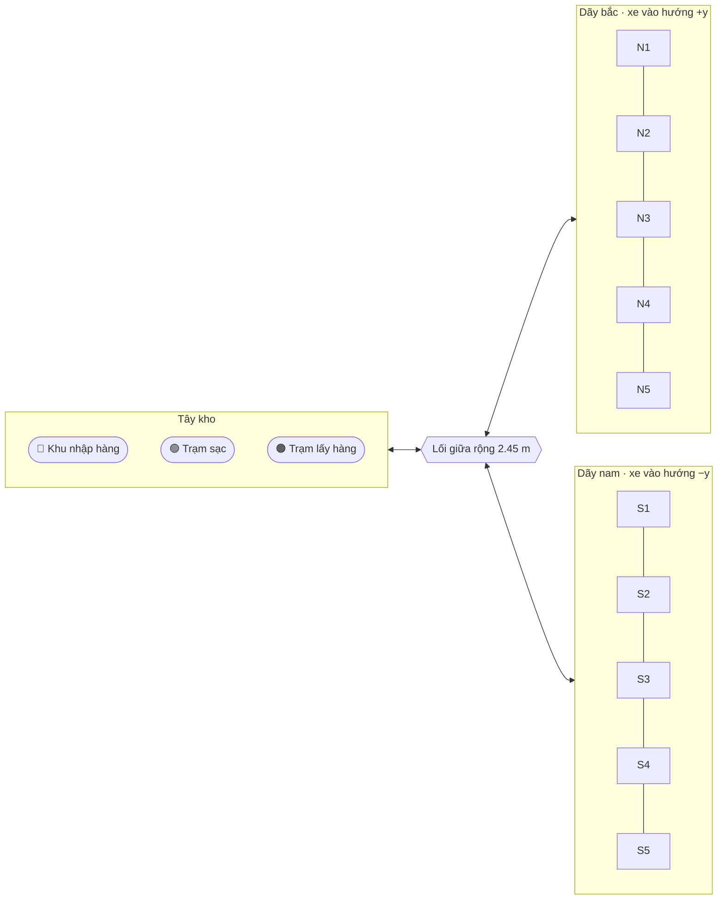
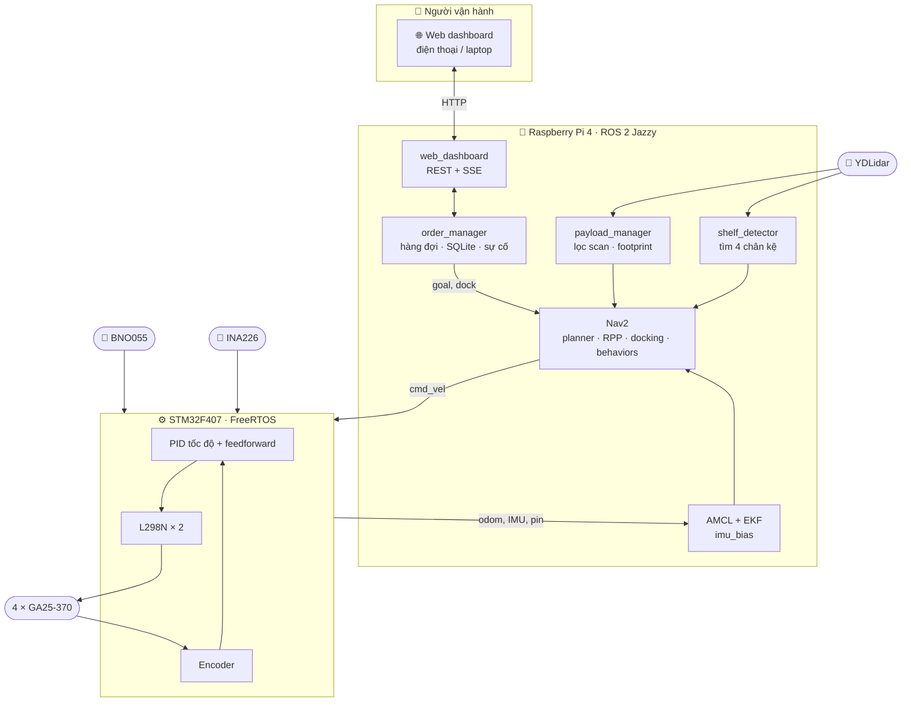
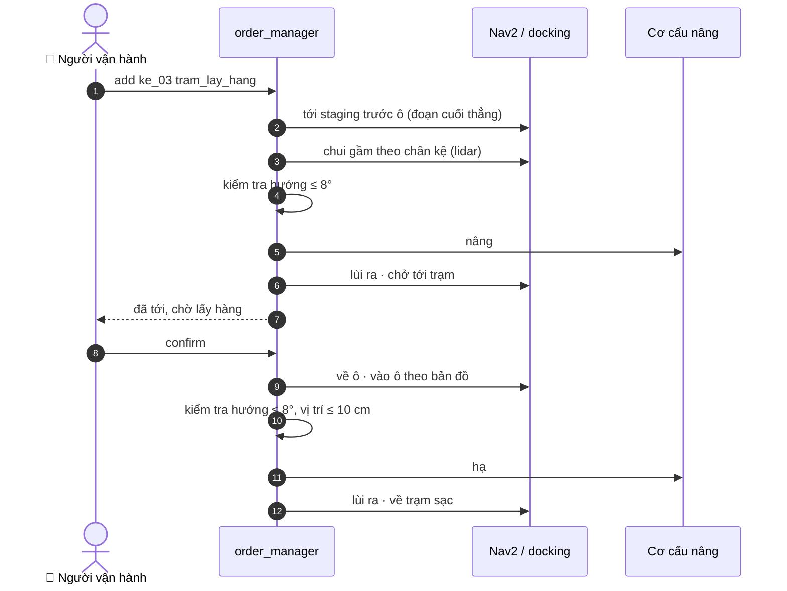
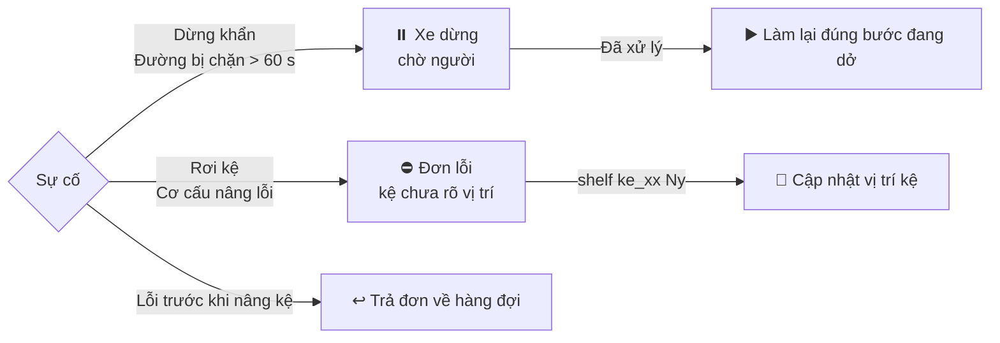
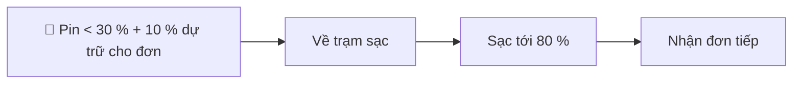
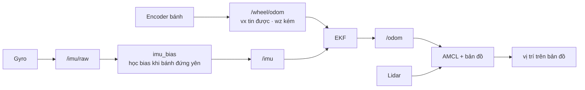
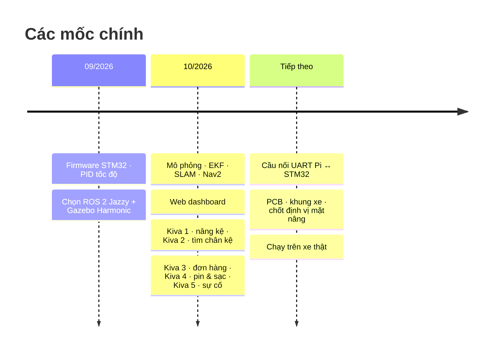
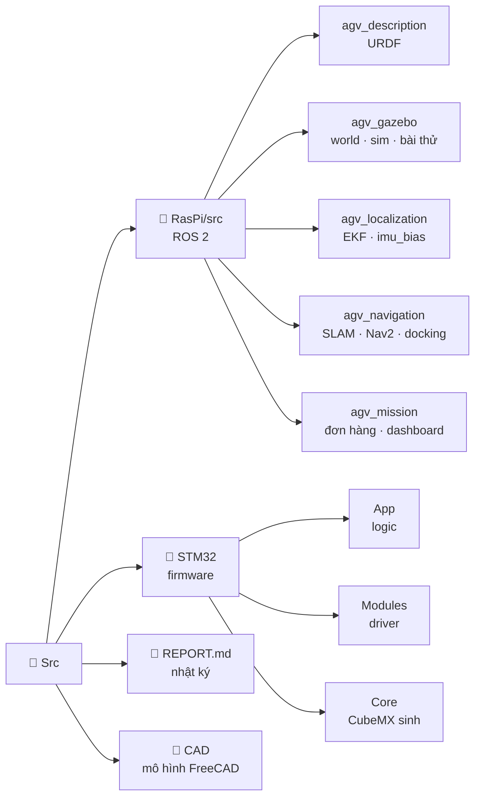

<div align="center">

# 🤖 DA2 · Robot AGV kho hàng kiểu Kiva

**Xe tự hành chui gầm, nâng kệ hàng, chở tới trạm lấy hàng rồi trả về ô và tự đi sạc.**

ROS 2 Jazzy · Nav2 · Gazebo Harmonic · Raspberry Pi 4 · STM32F4 · FreeRTOS

[Mô phỏng & ROS 2](RasPi/README.md) · [Nhật ký quá trình](REPORT.md) · [Firmware STM32](STM32/)

</div>

---

## ✨ Xe làm được gì

| 📦 Nhận đơn | 🛞 Chui gầm & nâng kệ | 🚚 Chở tới trạm | 🔋 Tự sạc | 🚨 Xử lý sự cố |
|:---:|:---:|:---:|:---:|:---:|
| Hàng đợi, ưu tiên, huỷ đơn trên web | Lidar tìm 4 chân kệ, căn giữa ≤ 1 cm | Nav2 + vùng cấm, footprint đổi theo tải | Pin thấp thì về trạm, sạc đủ mới nhận đơn | Dừng khẩn, đường bị chặn, rơi kệ |

---

## 🗺️ Kho hàng



8 kệ 0.75 × 0.75 m nằm trong 10 ô, cách nhau 1.1 m. Bố trí lấy từ một file duy nhất, [`shelves.yaml`](RasPi/src/agv_mission/config/shelves.yaml), từ đó sinh ra world Gazebo, danh sách dock của Nav2 và mặt nạ vùng cấm.

---

## 🧩 Kiến trúc



---

## 🔁 Một đơn hàng



---

## 🚨 Khi có sự cố





---

## 🧭 Định vị



---

## 📊 Kết quả trong mô phỏng

8 đơn liên tiếp, có mô phỏng vùng chết động cơ giống firmware (≥ 100 RPM):

| | Trước khi chỉnh | Sau khi chỉnh |
|---|:---:|:---:|
| Đơn xong | 8/8 | **8/8** |
| Thời gian TB / đơn | 105 s | **88 s** |
| Quay thừa khi trả kệ (lớn nhất) | 4198° | **75°** |
| Nav2 phải tự hồi phục | nhiều lần | **0** |
| Góc trôi khi đứng yên 5 phút | 2.4°–12° | **0.05°** |

| Bài thử | Kết quả |
|---|---|
| Chui gầm theo chân kệ (kệ đặt lệch) | 6/6, lệch ngang ≤ 0.9 cm · theo bản đồ chỉ 2/6 |
| Đơn hàng + ưu tiên + huỷ | 3/3 |
| Sạc giữa chừng | 3/3 đơn, tự về sạc rồi làm tiếp |
| Sự cố (dừng khẩn, rơi kệ, tường chắn) | dừng khẩn & rơi kệ: 4/4 lần · tường chắn: 2/4 lần |

Cách đo, các lần sai và cách sửa: [REPORT.md](REPORT.md).

---

## 🛣️ Tiến độ



---

## 🚀 Chạy thử

```bash
# WSL Ubuntu 24.04 + ROS 2 Jazzy (xem RasPi/README.md để cài)
cd ~/agv_ws && colcon build --symlink-install && source install/setup.bash
ros2 launch agv_gazebo sim.launch.py nav:=true
```

Sau đó mở **http://localhost:8080**, chọn kệ và trạm rồi bấm **Tạo đơn**.

---

## 📁 Cấu trúc repo



<div align="center">

Đồ án 2 · HK261

</div>
